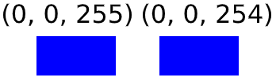

# Introduction

This is a steganography software to read/write hidden messages in the pixels of images.

* **Steganography** is the practice of concealing a file, message, image, or video within another file, message, image, or video. The word steganography comes from Greek steganographia, which combines the words steganós, meaning "covered or concealed", and -graphia meaning "writing".

Let's start with a picture. This is the original image:


This is the modified image with the hidden message:


But wait, they look exactly the same, right? That is good, it means the changes made in the image were not perceptible by human eyes.

If you want to understand better how the LSB (Least Significant Bit) works check the following explanation.

## How LSB works

To understand how LSB works you need to understand first how a pixel works.

A pixel color is defined by 3 channels: **R**ed, **G**reen, **B**lue, also known as RGB.

Each channel can have a value in a range between 0 and 255. The higher the value of a channel, the more intense its color.

|       |  R  |  G  |  B  |
|-------|:---:|:---:|:---:|
| black |  0  |  0  |  0  |
| red   | 255 |  0  |  0  |
| green |  0  | 255 |  0  |
| blue  |  0  |  0  | 255 |
| white | 255 | 255 | 255 |

You can use any combination of those channels to generate the color you want.

### Binary

Each channel of a pixel needs 1 byte, which means, 8 bits, that is, 8 1s and 0s.

Let's check an example of a blue pixel:

|         |    R     |    G     |    B     |
| ------- | :------: | :------: | :------: |
| integer |    0     |    0     |   255    |
| binary  | 00000000 | 00000000 | 11111111 |

It will result in a blue pixel, but what will happen if we change the value of the blue channel from 255 to 254?

|         |    R     |    G     |    B     |
| ------- | :------: | :------: | :------: |
| decimal |    0     |    0     |   254    |
| binary  | 00000000 | 00000000 | 11111110 |

We just change a single bit of the pixel, the last one (the **L**east **S**ignificant **B**it). Let's check the colors:



The two blue colors are pretty similar. Even if they're joined we won't be able to see the difference:


We can make this change on the 3 channels, it means that we can store 3 bits per pixel and the final image will look much similar to the original one.

### ASCII Table

To encode the message, we get the respective decimal value from the [ASCII table](http://www.asciitable.com/). Check the following example:

If we want to encode a single letter "a", the decimal value for this letter according to the table is 97, in binary: **01100001**.

How we can store 3 bits per pixel, only changing the last bit, we'll need 3 pixels to encode the 'a' in our image.

The first pixel will store **0 1 1**, on the lasts bits of each RGB channel, the second will store **0 0 0**, and the third will store **0 1** (the blue channel will not be needed for this one).

Joining the last bits of these pixels we'll have: **01100001**, converting this binary to decimal will result in 97, which is "a" according to the ASCII table.

# How to use

## To write a message in an image:

`python3 pylsb.py -i <image-path.png> -f <message-path.txt> -w`

## To read a message from an image

`python3 pylsb.py -i <image-path.png> -r`

**Note: to read the message, use the generated image, not the original.**

Check the beginning of the generated text file.

## Example

You can test using the files of this repository.

### Generate the image:

`python3 pylsb.py -i assets/tiger.png -f assets/message.txt -w`

You wrote the content of the file **message.txt** on the image **tiger-lsb.png** in the assets folder.

### Reading this message

`python3 pylsb.py -i assets/tiger-lsb.png -r -p`

You read the pixels of this image, and outputs the message on the **tiger-lsb.txt** file, in the assets folder.

**Note: the -p flag is just to output printable chars.**

### Checking the message

If you read the **tiger-lsb.txt** image you will see the message followed by many random chars:

```
Remember that happiness is a way
of travel, not a destination.
Open mind for a different view.
Everybody has a different way to
view the world
UTj*UZrIjUVUJj*&Qj...
```
# References

- [Steganography](https://en.wikipedia.org/wiki/Steganography)
- [RGB color model](https://en.wikipedia.org/wiki/RGB_color_model)
- [Binary number](https://en.wikipedia.org/wiki/Binary_number)
- [ASCII table](http://www.asciitable.com/)
- [Tiger image Reference](https://pixabay.com/pt/photos/tigre-neve-roncando-585855/)